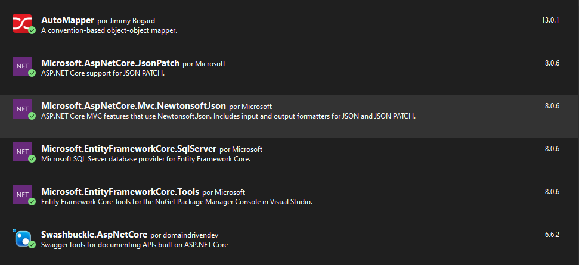

1. El proyecto esta trabajandado con .Net8 WebApi.
2. Para poder ejecutarlo necesita tener instalado los siguientes paquetes.
- 

3. esto abrira una manejador de apis por defecto ya que no logre consumirla y hacerle un crud grafico. Pero si podemos Crear, Modificar, Elimnar, leer los datos desde la deb.

4. Tambien va un Backup de la db creada ya que la bases de datos, toda la base de datos fue creada con entityFramework. 